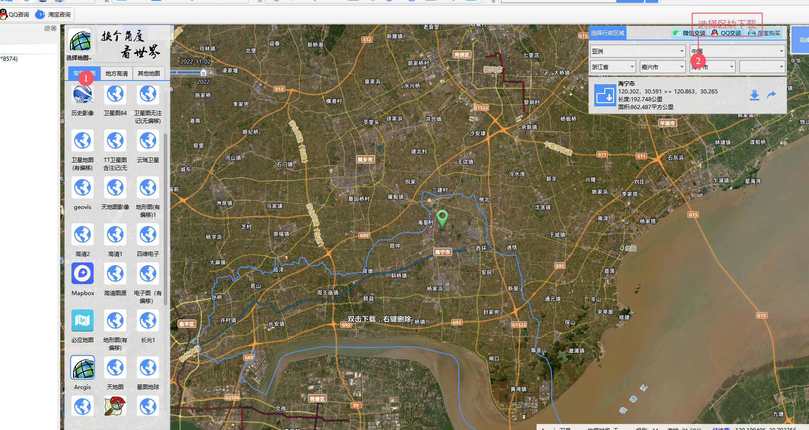
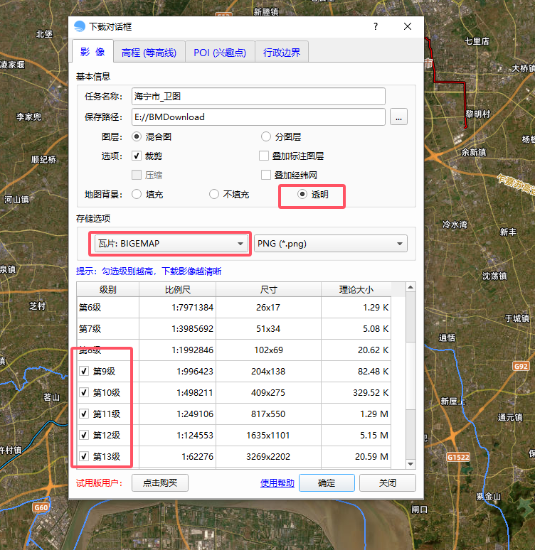
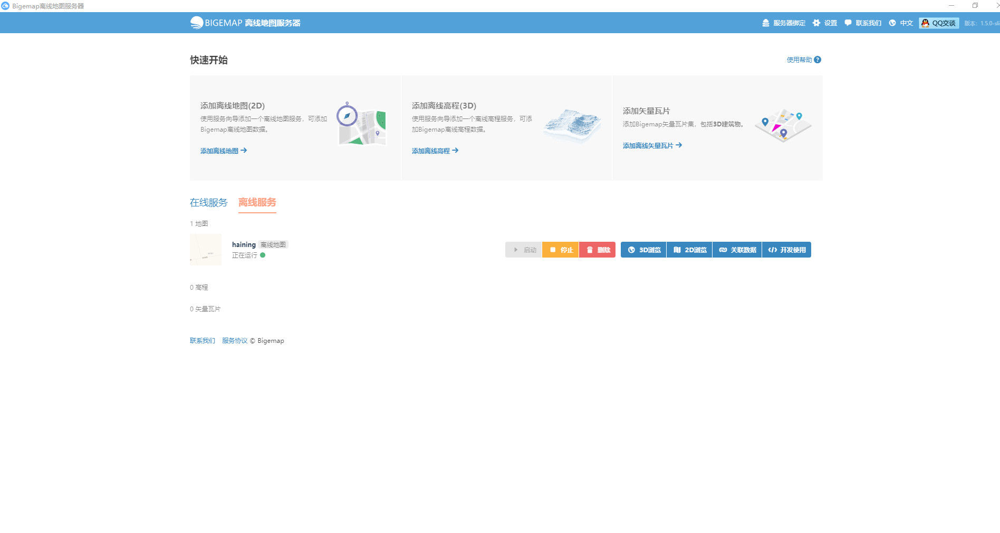
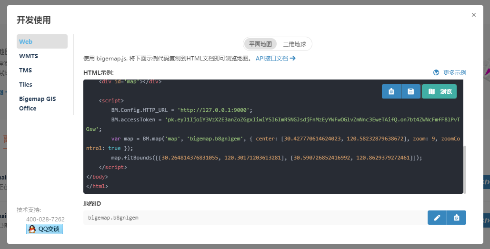

# Vue 3 + Vite

This template should help get you started developing with Vue 3 in Vite. The template uses Vue 3 `<script setup>` SFCs, check out the [script setup docs](https://v3.vuejs.org/api/sfc-script-setup.html#sfc-script-setup) to learn more.

Learn more about IDE Support for Vue in the [Vue Docs Scaling up Guide](https://vuejs.org/guide/scaling-up/tooling.html#ide-support).

[BIGEMAP GIS OFFICE](http://www.bigemap.com/reader/download/detail2018020113.html)

[Bigemap Server（开发版）](http://www.bigemap.com/reader/download/detail201802017.html)

### 选择地图

### 下载离线地图

### 部署离线地图服务器

### 开发使用
